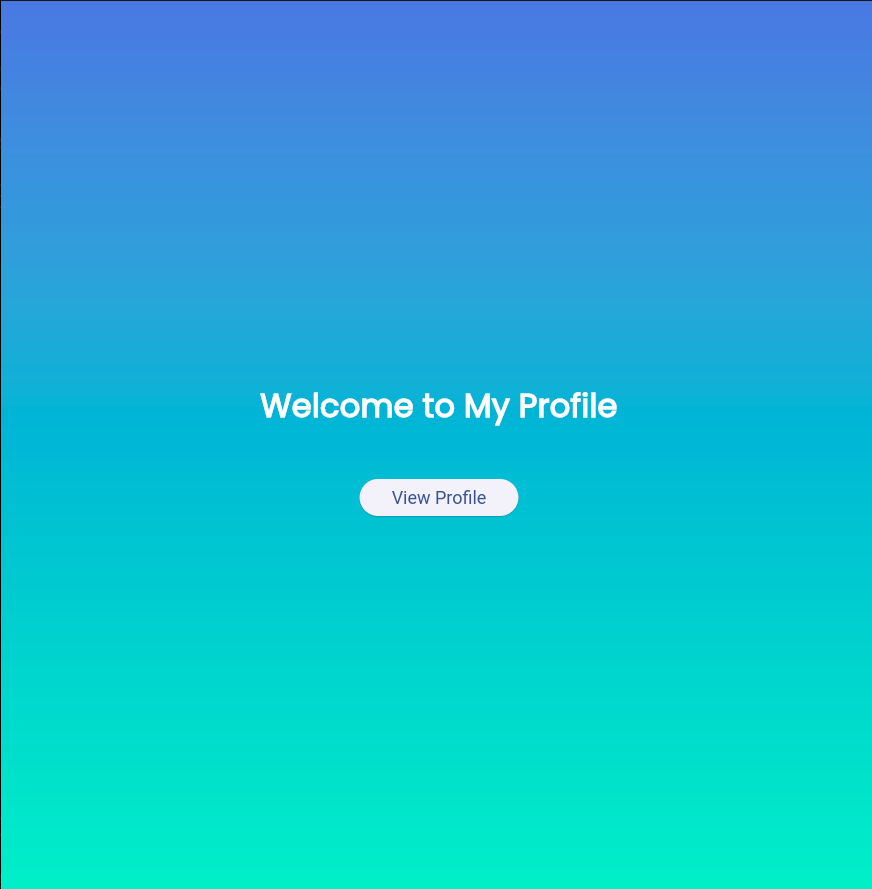
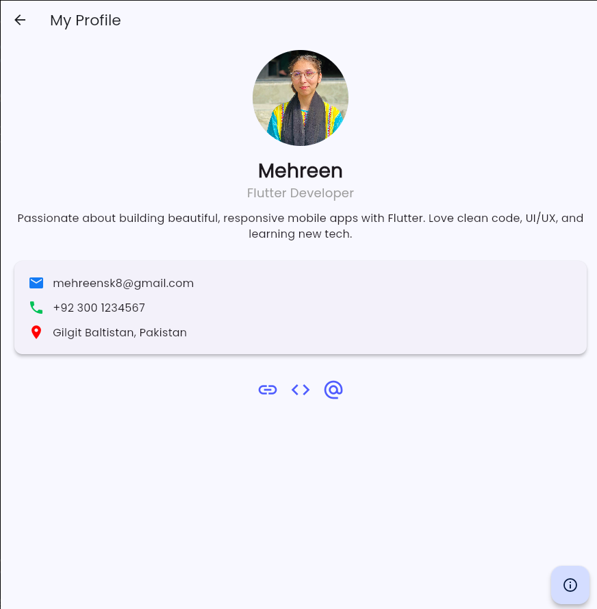
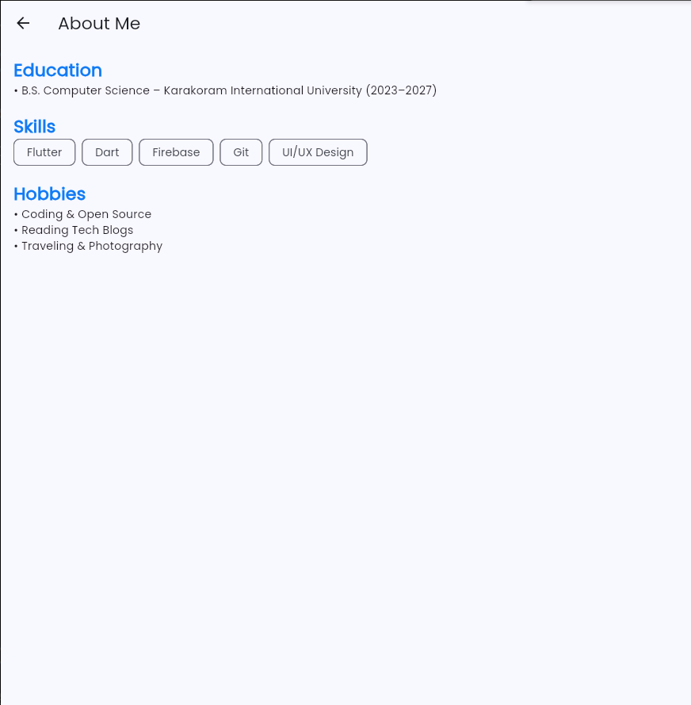

# My Profile App

**A beautiful, responsive personal profile app built with Flutter**  
Showcases **Material Design**, **navigation**, **custom widgets**, and **clean architecture**.

---

## Features

| Feature | Implemented |
|-------|-------------|
| Welcome Screen with Gradient | Yes |
| Profile Screen with Avatar & Bio | Yes |
| Contact Card with Icons | Yes |
| Social Media Buttons (LinkedIn, GitHub, Email) | Yes (with Font Awesome) |
| About Me Page with ListView & Chips | Yes |
| Floating Action Button Navigation | Yes |
| Fully Responsive (Mobile & Web) | Yes |
| Google Fonts (Poppins) | Yes |
| Clean Folder Structure | Yes |

---

## Screenshots

| Welcome | Profile | About Me |
|--------|--------|--------|
|  |  |  |

> *Screenshots taken on Chrome (Web)*

## Tech Stack

- **Framework**: Flutter (Dart)
- **UI**: Material Design 3
- **Fonts**: [Google Fonts - Poppins](https://fonts.google.com/specimen/Poppins)
- **Icons**: [Font Awesome Flutter](https://pub.dev/packages/font_awesome_flutter)
- **Packages**:
  ```yaml
  google_fonts: ^6.2.1
  font_awesome_flutter: ^10.7.0
